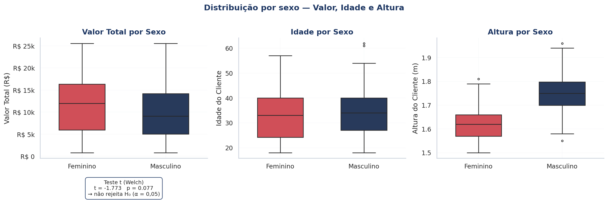
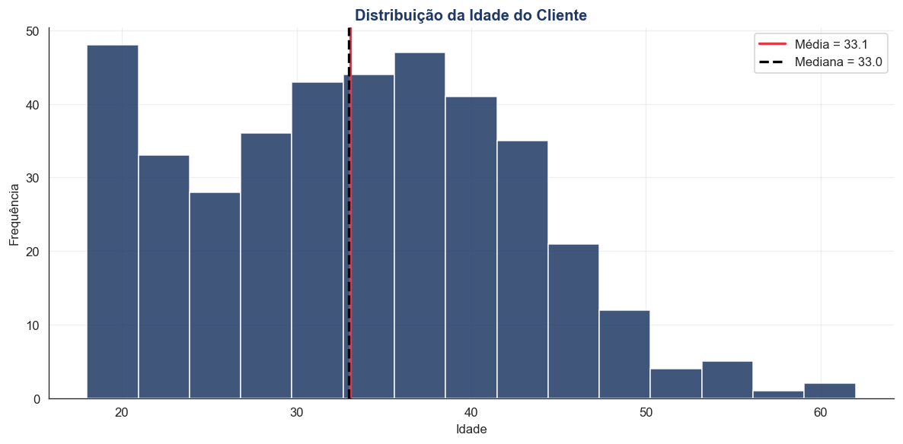
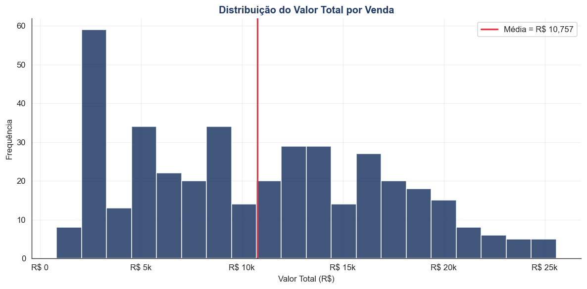
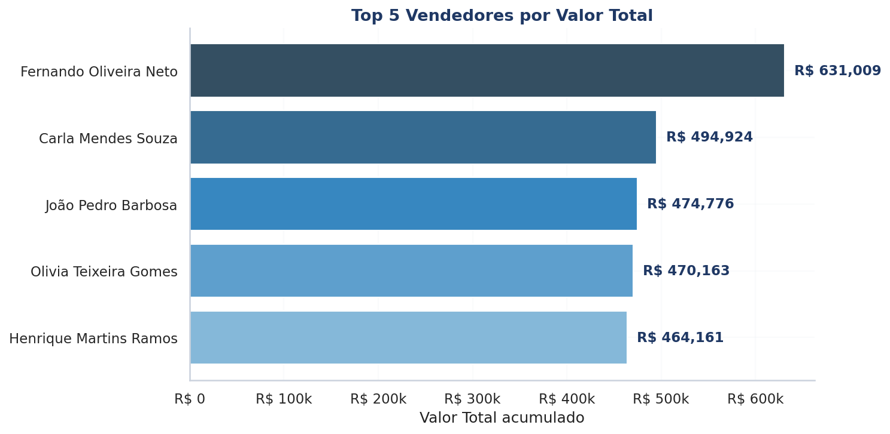
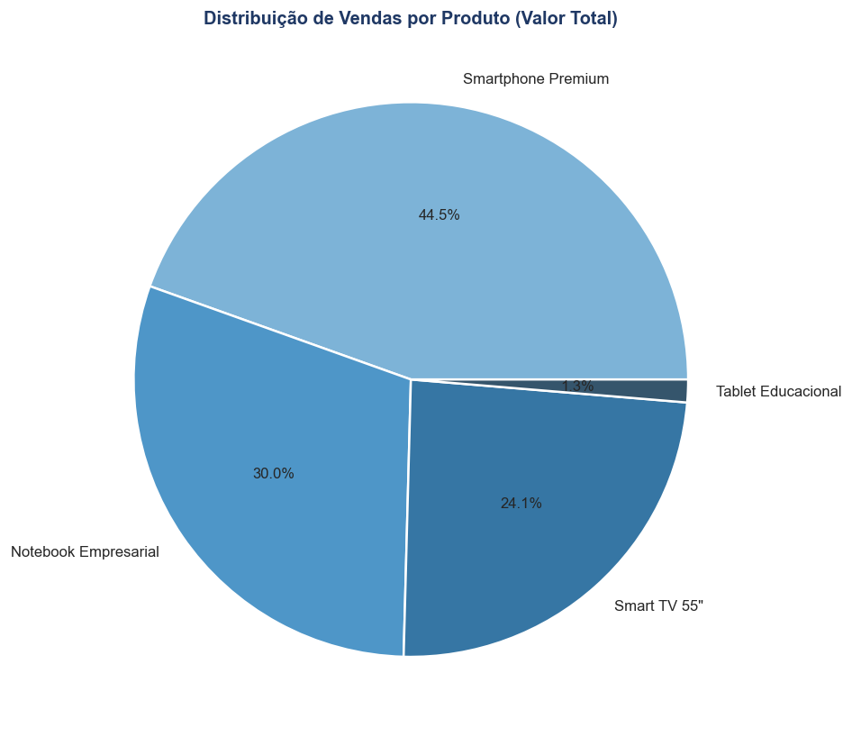
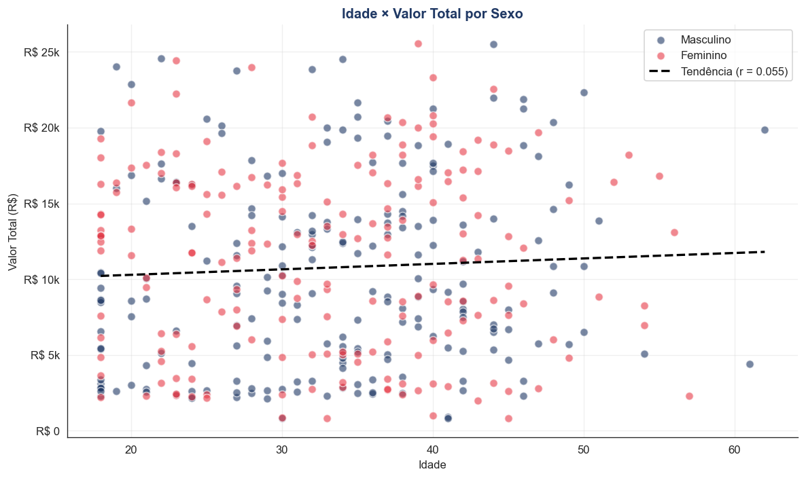
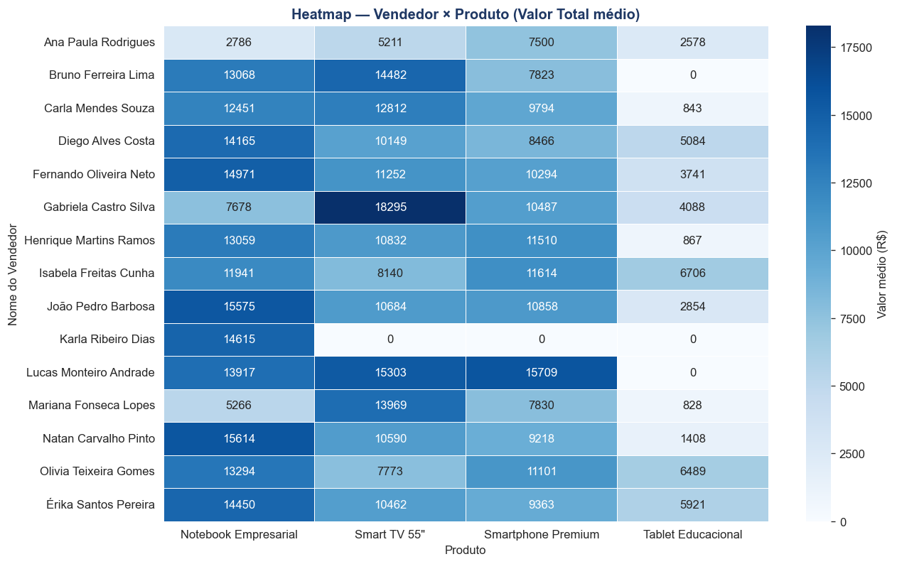
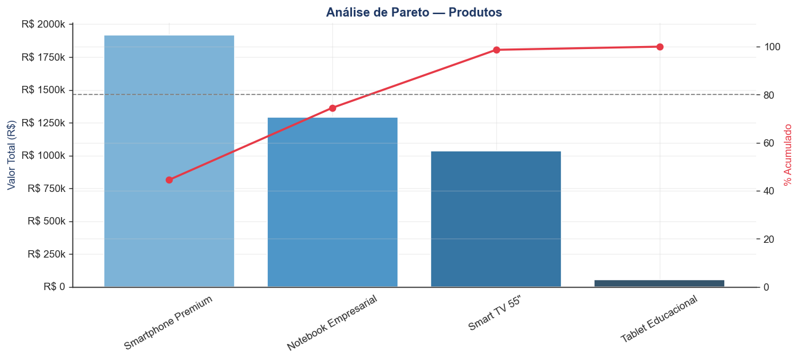

# Análise de Vendas — Grupo 06

Trabalho de Probabilidade e Estatística — análise descritiva, gráficos e testes sobre a base `Grupo_06_Dados_Vendas.xlsx` (400 vendas).

## Estrutura

- `analise_vendas.py` — script único organizado em funções:
  - `carregar_dados()` — leitura do Excel + criação das faixas etárias e de altura via `pd.cut`
  - `estatistica_descritiva()` — média, mediana, moda, desvio, variância, CV%, quartis, IQR, mín/máx, assimetria e curtose
  - `gerar_graficos()` — boxplots por sexo, histogramas, top 5 vendedores, pizza, dispersão Idade × Valor
  - `analises_estrategicas()` — top vendedores, produtos, faixa etária, sexo × produto, ranking vs média geral
  - `analises_complementares()` — heatmap, Pareto, teste t bicaudal (M vs F), tabela altura × produto
  - `main()` — orquestra tudo

## Como executar

```bash
pip install pandas numpy matplotlib seaborn scipy openpyxl
python analise_vendas.py
```

Ajuste a constante `CAMINHO` no início do script para apontar ao seu arquivo Excel.

## Saídas

Os 8 gráficos são salvos como `.png` no diretório de execução e exibidos com `plt.show()`. Todas as tabelas são impressas no terminal.

## Galeria de gráficos

### 1. Boxplots por Sexo — Valor Total, Idade e Altura


### 2. Histograma da Idade do Cliente (média e mediana)


### 3. Histograma do Valor Total por venda


### 4. Top 5 vendedores por Valor Total


### 5. Distribuição de vendas por Produto


### 6. Dispersão Idade × Valor Total por Sexo (com linha de tendência)


### 7. Heatmap — Vendedor × Produto (Valor Total médio)


### 8. Análise de Pareto — Produtos


## Principais resultados

- Vendedor líder: **Fernando Oliveira Neto** — R$ 631.008,53 (14,67% do total).
- Produto líder: **Smartphone Premium** — 44,54% do faturamento.
- Pareto: **3 produtos** (Smartphone + Notebook + Smart TV) concentram ~98,7% das vendas; 80% saem dos 2 primeiros.
- Teste t bicaudal Valor Total ~ Sexo: t = −1,77; p = 0,077 → **não se rejeita H0** (sem diferença significativa entre médias masculina e feminina ao nível α = 0,05).
